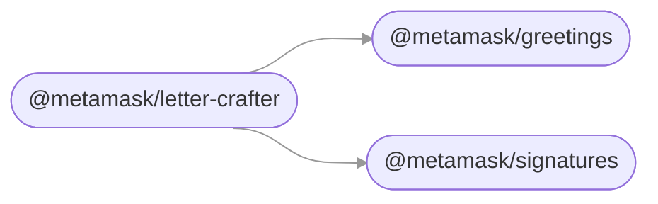

# MetaMask Monorepo Template

This is a template for creating new monorepos under the MetaMask GitHub organization. (Replace this description with your own.)

> [!note]
>
> ## Template Instructions
>
> To use this template, follow these steps:
>
> 1. Click on the "Use this template" button in the top-left corner of the repo, then select "Create a new repository". Follow the instructions to make a new repo.
> 2. Once the new repo is created, run `yarn install`.
> 3. Remove all subdirectories in `packages/`.
> 4. Re-run `yarn readme-content:update`.
> 5. Open `tsconfig.json`, `tsconfig.build.json`, and `tsconfig.lint.json` and reset `references` to an empty array in each.
> 6. Replace `metamask-monorepo-template` with the name of your repo throughout `docs/`, `.github/workflows/publish-preview.yml`, and `package.json`.
> 7. Update the title and description at the top of this README to match your repo.
> 8. Update `.github/CODEOWNERS` to match your team.
> 9. Open `scripts/create-package/package-template/README.md` and replace `THIS-REPO` with the name of your repo.
> 10. Set the `RELEASE_COMMIT_PREFIX` and `TOKEN_EXCHANGE_URL` repository variables, and create a `default-branch` GitHub environment (used by the preview build and changelog workflows).
> 11. Delete this "Template Instructions" section.
> 12. [Add a new package using the `create-package` tool.](./docs/processes/adding-new-packages.md)

## Contributing

See the [Contributor Documentation](./docs) for help on:

- Setting up your development environment
- Working with the monorepo
- Testing changes to a package in other projects
- Issuing new releases
- Creating a new package

## Packages

<!-- start package list -->

- [`@metamask/greetings`](packages/greetings)
- [`@metamask/letter-crafter`](packages/letter-crafter)
- [`@metamask/signatures`](packages/signatures)

<!-- end package list -->

<!-- start dependency graph -->

<!-- end dependency graph -->

(This section may be regenerated at any time by running `yarn readme-content:update`.)
